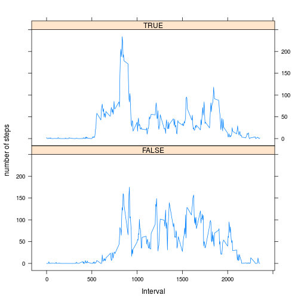

# Load the data


```r
setwd("/home/jmorris/workspace/learnR/reproducibleResearch/RepData_PeerAssessment1/")
```


1. Load the data (i.e. read.csv())


```r
activity = read.csv("activity.csv")
```


# What is the mean total number of steps taken per day? ###########


1. Make a histogram of the total number of steps taken each day


```r
dailySteps = tapply(activity$steps, activity$date, sum)
hist(dailySteps)
```

 


2. Calculate and report the mean and median total number of steps taken per day


```r
summary(dailySteps)
```

```
##    Min. 1st Qu.  Median    Mean 3rd Qu.    Max.    NA's 
##      41    8840   10800   10800   13300   21200       8
```

> mean total steps = 10770
> median total steps = 10760

# Average datily activity pattern? ##########


1. Make a time series plot (i.e. type = "l") of the 5-minute interval (x-axis) and the average number of steps taken, averaged across all days (y-axis)


```r
intervalAvgs = tapply(activity$steps, activity$interval, mean, na.rm = TRUE)
intervals = tapply(activity$interval, activity$interval, mean, na.rm = TRUE)
plot(intervals, intervalAvgs, type = "l")
```

 


2. Which 5-minute interval, on average across all the days in the dataset, contains the maximum number of steps?


```r
intervalDF = data.frame(intervals, intervalAvgs)
which.max(intervalDF$intervalAvgs)
```

```
## 835 
## 104
```

> interval with most steps = 835


# Imputing missing values ########

1. Calculate and report the total number of missing values in the dataset (i.e. the total number of rows with NAs)
```
summary(activity)
```
> total number of missing values for steps = 2304

2. Devise a strategy for filling in all of the missing values in the dataset. The strategy does not need to be sophisticated. For example, you could use the mean/median for that day, or the mean for that 5-minute interval, etc.

> Strategy: use mice package for multiple imputation as the results are more robust

3. Create a new dataset that is equal to the original dataset but with the missing data filled in.


```r
library(mice)
```

```
## Loading required package: Rcpp
## mice 2.21 2014-02-05
```

```r
activityImputed = complete(mice(activity))
```

```
## 
##  iter imp variable
##   1   1  steps
##   1   2  steps
##   1   3  steps
##   1   4  steps
##   1   5  steps
##   2   1  steps
##   2   2  steps
##   2   3  steps
##   2   4  steps
##   2   5  steps
##   3   1  steps
##   3   2  steps
##   3   3  steps
##   3   4  steps
##   3   5  steps
##   4   1  steps
##   4   2  steps
##   4   3  steps
##   4   4  steps
##   4   5  steps
##   5   1  steps
##   5   2  steps
##   5   3  steps
##   5   4  steps
##   5   5  steps
```


4. Make a histogram of the total number of steps taken each day and Calculate 


```r
dailyStepsImputed = tapply(activityImputed$steps, activityImputed$date, sum)
hist(dailyStepsImputed)
```

 


and report the mean and median total number of steps taken per day. 


```r
summary(dailyStepsImputed)
```

```
##    Min. 1st Qu.  Median    Mean 3rd Qu.    Max. 
##      41    9820   11400   11100   13500   21200
```

> mean total steps = 11440
> median total steps = 11460

Do these values differ from the estimates from the first part of the assignment? 

> Yes these values differ from the first part of the assignment, which makes sense as the NA values are being replaced with actual values.

What is the impact of imputing missing data on the estimates of the total daily number of steps?

> The imputation does not change the daily totals in many cases (as these days dont have any NA values), however some are changed.

# Are there differences in activity patterns beetween weekdays and weekends?

1. Create a new factor variable in the dataset with two levels – “weekday” and “weekend” indicating whether a given date is a weekday or weekend day.


```r
weekdayVector = weekdays(as.Date(as.character(activity$date), format = "%Y-%m-%d"))
weekend = (weekdayVector == "Sunday" | weekdayVector == "Saturday")
weekday = !(weekend)
activity$weekend <- weekend
```


2. Make a panel plot containing a time series plot (i.e. type = "l") of the 5-minute interval (x-axis) and the average number of steps taken, averaged across all weekday days or weekend days (y-axis). The plot should look something like the following, which was creating using simulated data:


```r
library(lattice)

activity$weekday <- weekday
activity$weekday <- factor(activity$weekday)

weekdayDF <- aggregate(steps ~ interval + weekday, data = activity, mean)
names(weekdayDF) <- c("interval", "weekday", "steps")

xyplot(steps ~ interval | weekday, weekdayDF, t = "l", layout = c(1, 2), xlab = "Interval", 
    ylab = "number of steps")
```

 


